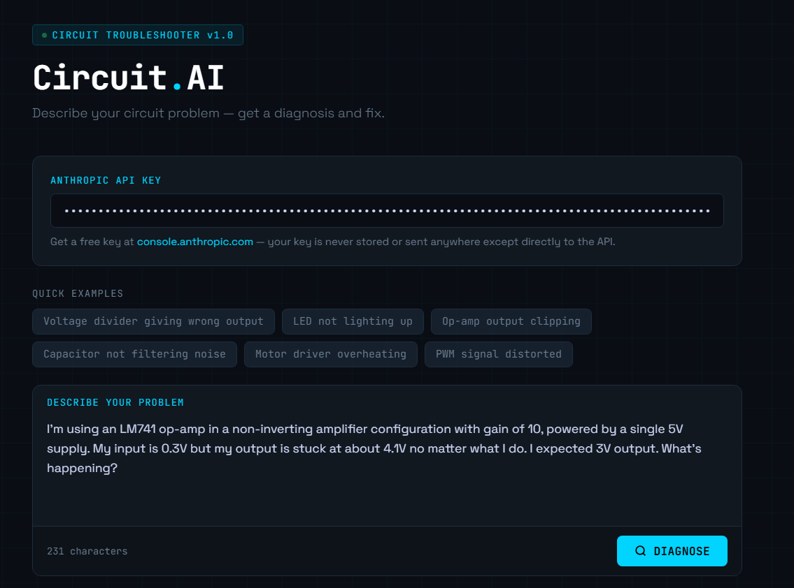

# Circuit Troubleshooter AI

A web-based tool that uses the Claude AI API to diagnose electrical circuit faults from natural language descriptions.

## Features
- Describe any circuit problem in plain English and get a structured diagnosis
- Returns root cause analysis, fix steps, and measurement verification instructions
- Quick-example chips for common fault types (voltage dividers, op-amps, PWM, LEDs)
- Session history to review past diagnoses
- No installation required — runs entirely in the browser

## Demo

## How to Use
1. Get a free API key at [console.anthropic.com](https://console.anthropic.com)
2. Download `circuit_troubleshooter.html`
3. Open it in any browser
4. Paste your API key and describe your problem

## Example Problems Tested
- Voltage divider output drop under load (Arduino analog input impedance)
- LED failure from missing current-limiting resistor
- Decoupling capacitor ineffective due to placement distance
- PWM motor control dead zone at low duty cycles
- Op-amp output unable to swing to rail on single supply

## Tech Stack
- Vanilla HTML/CSS/JavaScript
- Anthropic Claude API (`claude-sonnet-4-5`)
- No frameworks, no build tools, no dependencies

## What I Learned
- How to call the Anthropic API directly from a browser using fetch
- Prompt engineering to return structured, actionable engineering responses
- Handling API authentication and error states in a frontend app
